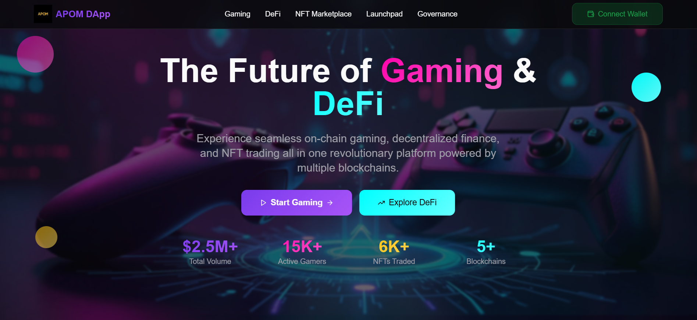
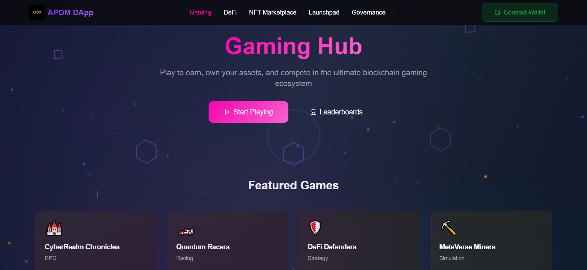
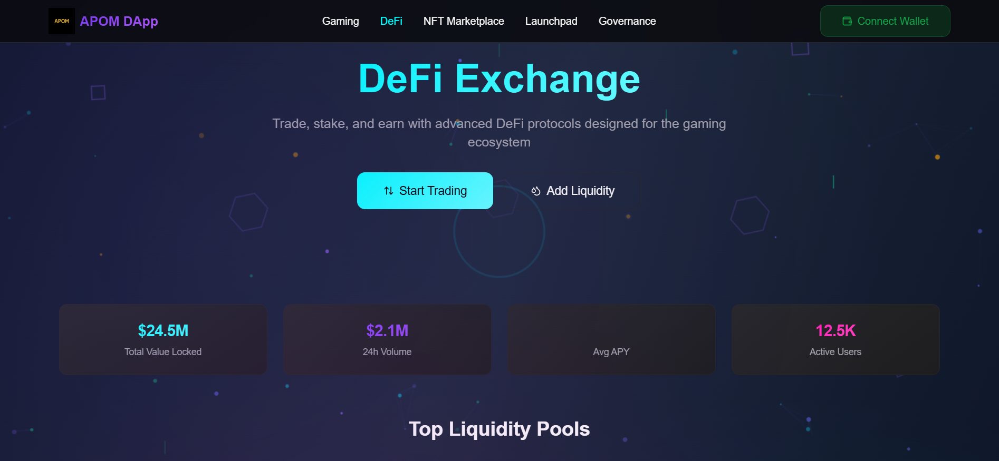

# 🛠️ Decentralized Gaming & DeFi Platform - Local Setup Guide

## 📸 Platform Screenshots

### Home Page - The Future of Gaming & DeFi

*Experience seamless on-chain gaming, decentralized finance, and NFT trading all in one revolutionary platform powered by multiple blockchains.*

### Gaming Hub - Play to Earn

*Play to earn, own your assets, and compete in the ultimate blockchain gaming ecosystem with featured games and leaderboards.*

### DeFi Exchange - Advanced Trading

*Trade, stake, and earn with advanced DeFi protocols designed for the gaming ecosystem with real-time liquidity pools and trading data.*

---

Welcome! 👋
This guide will walk you through setting up the **Decentralized Gaming & DeFi Platform** on your computer for development or testing.
No prior coding knowledge is required — just follow the steps carefully.

---

## 📦 Prerequisites

Before setting up the Decentralized Gaming & DeFi Platform, you need to install three tools:

### 1. Node.js (v22)

Node.js allows you to run JavaScript on your computer. Our project requires version **22**.

**Install:**

* Go to the [Node.js download page](https://nodejs.org/).
* Download the **LTS (Long-Term Support) version 22** for your operating system (Windows, macOS, or Linux).
* Run the installer and follow the instructions.
* ✅ **Important:** During installation, check the box:
  *"Automatically install the necessary tools"*

**Verify installation:**
Open your terminal (Command Prompt on Windows, Terminal on macOS/Linux) and run:

```bash
node -v
```

Expected output:

```
v22.x.x
```

> 💡 Node.js automatically installs **npm** (Node Package Manager), so you don't need to install npm separately.

---

### 2. npm (Node Package Manager)

npm is used to install the extra libraries our project needs.

**Verify installation (already installed with Node.js):**

```bash
npm -v
```

Expected output:

```
10.x.x
```

---

### 3. Git (Version Control)

Git lets you download and manage the project's source code.

**Install:**

* Go to the [Git official website](https://git-scm.com/downloads).
* Download the correct version for your operating system.
* Run the installer → keep the default settings unless you know otherwise.

**Verify installation:**

```bash
git --version
```

Expected output:

```
git version 2.x.x
```

---

## 🚀 Local Setup

Once you have Node.js, npm, and Git installed, follow these steps:

### Step 1: Clone the Repository

Copy the project from Bitbucket to your computer:

```bash
git clone https://bitbucket.org/web3_devs/apom_dapp.git
```

Move into the project folder:

```bash
cd apom_dapp
```

---

### Step 2: Install Dependencies

Install all required software packages (both frontend and backend):

```bash
npm install
```

This may take a few minutes.
After success, you'll see a new folder called **node_modules** inside the project.

---

### Step 3: Start the Project

Run the project locally (both frontend and backend):

```bash
npm run dev
```

* Your default browser should open automatically.
* If not, open [http://localhost:8080](http://localhost:8080) manually.
* You should now see the **Decentralized Gaming & DeFi Platform running** 🎉

---

## 🔧 Backend Server

The platform includes a powerful backend server that provides APIs and real-time updates for all features.

### Backend Features

- **RESTful APIs** for Gaming, DeFi, NFT, Launchpad, and Governance
- **WebSocket Support** for real-time market data and game updates
- **Mock Data System** with realistic gaming and DeFi data
- **Security Features** including CORS, rate limiting, and Helmet protection
- **Comprehensive Error Handling** and logging

### Backend Access

- **Server URL**: http://localhost:3001
- **Health Check**: http://localhost:3001/health
- **API Base**: http://localhost:3001/api
- **WebSocket**: ws://localhost:3001

### Available API Endpoints

#### Gaming APIs
- `GET /api/gaming/games` - List all games
- `GET /api/gaming/games/:id` - Get game details
- `GET /api/gaming/leaderboard` - Gaming leaderboard
- `POST /api/gaming/games/:id/start` - Start game session
- `POST /api/gaming/games/:id/end` - End game session

#### DeFi APIs
- `GET /api/defi/pools` - List liquidity pools
- `GET /api/defi/overview` - DeFi market overview
- `GET /api/defi/leaderboard` - DeFi leaderboard
- `POST /api/defi/swap` - Execute token swaps

#### NFT APIs
- `GET /api/nft/collections` - List NFT collections
- `GET /api/nft/nfts` - List all NFTs
- `POST /api/nft/nfts/:id/list` - List NFT for sale
- `POST /api/nft/nfts/:id/buy` - Buy NFT

#### Launchpad APIs
- `GET /api/launchpad/projects` - List launchpad projects
- `POST /api/launchpad/projects/:id/participate` - Participate in IDO

#### Governance APIs
- `GET /api/governance/proposals` - List governance proposals
- `POST /api/governance/proposals/:id/vote` - Vote on proposal

### WebSocket Real-time Updates

The backend provides real-time updates via WebSocket:

```javascript
const ws = new WebSocket('ws://localhost:3001');

ws.onmessage = (event) => {
  const data = JSON.parse(event.data);
  
  switch (data.type) {
    case 'market_data_update':
      // Handle market data updates
      break;
    case 'game_update':
      // Handle game updates
      break;
    case 'defi_update':
      // Handle DeFi updates
      break;
  }
};
```

### Backend Development

#### Start Backend Only
```bash
npm run dev:backend
```

#### Backend Logs
The backend server logs all API requests, WebSocket connections, and errors to the console.

#### Environment Configuration
Create a `.env` file in the backend directory:
```env
PORT=3001
NODE_ENV=development
FRONTEND_URL=http://localhost:8080
```

---

## 🎮 Frontend Application

The React frontend provides a modern, responsive interface for all platform features.

### Frontend Features

- **Responsive Design** - Works on desktop, tablet, and mobile
- **Real-time Updates** - Live data from WebSocket connections
- **Modern UI Components** - Built with Radix UI and Tailwind CSS
- **Type Safety** - Full TypeScript support
- **State Management** - TanStack React Query for server state

### Frontend Access

- **Application URL**: http://localhost:8080
- **Development Server**: http://localhost:8080
- **Build Output**: `dist/` directory

### Frontend Development

#### Start Frontend Only
```bash
npm run dev:frontend
```

#### Build for Production
```bash
npm run build:frontend
```

---

## 🚀 Development Commands

### Start Both Servers
```bash
npm run dev              # Start frontend AND backend simultaneously
```

### Individual Server Control
```bash
npm run dev:frontend     # Start only frontend
npm run dev:backend      # Start only backend
```

### Building
```bash
npm run build            # Build both frontend and backend
npm run build:frontend   # Build only frontend
npm run build:backend    # Build only backend
```

### Quality Assurance
```bash
npm run lint             # Lint frontend code
npm run clean            # Clean all build artifacts
```

---

## 🔌 API Integration Examples

### Fetching Games Data
```javascript
const response = await fetch('http://localhost:3001/api/gaming/games');
const games = await response.json();
console.log(games.data); // Array of games
```

### Real-time Market Data
```javascript
const ws = new WebSocket('ws://localhost:3001');
ws.onopen = () => {
  ws.send(JSON.stringify({
    type: 'subscribe',
    action: 'market_data'
  }));
};
```

### User Authentication (Future)
```javascript
const response = await fetch('http://localhost:3001/api/user/login', {
  method: 'POST',
  headers: { 'Content-Type': 'application/json' },
  body: JSON.stringify({ email, password })
});
```

---

## 🧪 Testing the Setup

### 1. Verify Backend is Running
```bash
curl http://localhost:3001/health
```
Expected: `{"status":"OK","timestamp":"...","uptime":...}`

### 2. Verify Frontend is Running
Open http://localhost:8080 in your browser
Expected: APOM DApp homepage loads successfully

### 3. Test API Endpoints
```bash
curl http://localhost:3001/api/gaming/games
```
Expected: JSON response with games data

### 4. Test WebSocket Connection
Use browser console or a WebSocket testing tool to connect to `ws://localhost:3001`

---

## 🆘 Troubleshooting

### Common Issues

**Port Already in Use**
- Frontend (8080): Change port in `vite.config.ts`
- Backend (3001): Change port in `.env` file

**Dependencies Missing**
```bash
npm install
```

**Backend Won't Start**
- Check if port 3001 is available
- Verify `.env` file exists
- Check console for error messages

**Frontend Won't Load**
- Check if port 8080 is available
- Verify all dependencies are installed
- Check browser console for errors

**WebSocket Connection Failed**
- Ensure backend is running
- Check firewall settings
- Verify WebSocket URL format

### Getting Help

1. Check the console output for error messages
2. Verify all prerequisites are installed correctly
3. Ensure no other services are using the required ports
4. Check the backend logs for API errors

---

✅ That's it! You now have the **Decentralized Gaming & DeFi Platform** running locally with both frontend and backend fully operational.

---

## 📚 Next Steps

- **Explore the APIs**: Test different endpoints using tools like Postman or curl
- **Modify the Frontend**: Edit React components in the `src/` directory
- **Extend the Backend**: Add new routes in `backend/src/routes/`
- **Customize Data**: Modify mock data in `backend/src/data/mockData.js`
- **Add Real Database**: Replace mock data with MongoDB or PostgreSQL
- **Deploy**: Build and deploy to your preferred hosting platform

Happy coding! 🚀